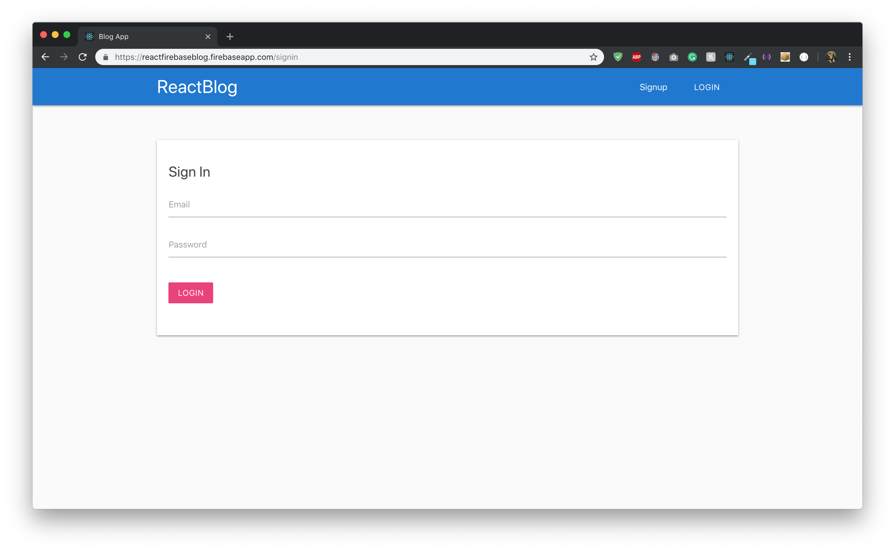
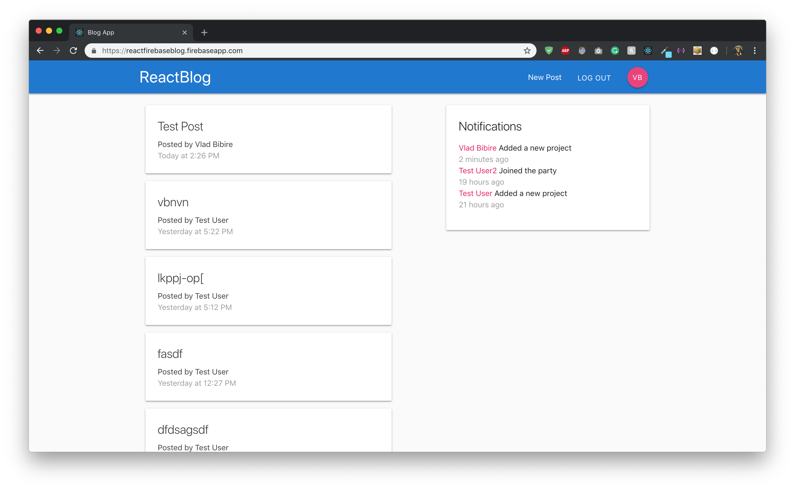
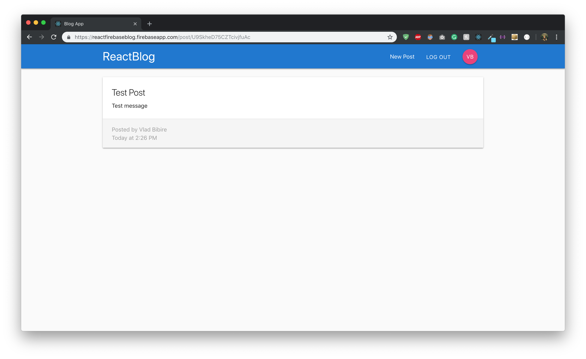
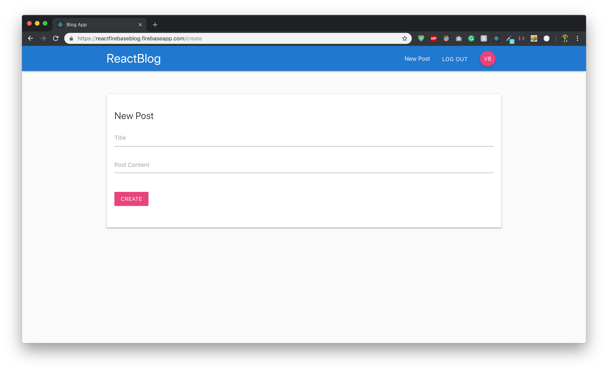

# ReactFirebaseBlog
### Description
A single page blog application based on React, Redux, Materialize(front-end) & Firebase(backend).

### Functionality
It has embedded 3 systems: **Users system**, **Post system** and **Notification system**. To keep track of each change and the state of each component, it was used **Redux** and lots of other dependencies. The styling was done using **Materialize** framework.

All the backend was done using **Firebase** which is a real-time database made by Google and incorporates a lot of other functions than just storing data. Basically, auth system, notifications and posting are all stored inside it, using its **functions** capabilities.

### Live Preview:
[https://reactfirebaseblog.firebaseapp.com](https://reactfirebaseblog.firebaseapp.com)

## Snapshots
| | |
| -------------- |:--------------:|

### System Preparation
If you want to use this app, you need to have installed **Node.js** on your machine.

### Development mode
1. `git clone` this repository into your environment.
2. `cd` into the app folder.
3. `npm install` to install all necesesarry dependencies.
4. `npm start` to run the app
5. Open the app in your favourite code editor.
6. Happy hacking!